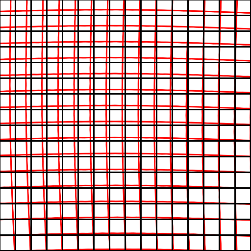
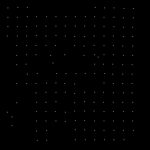

# Local Geometric Distortions Resilient Watermarking Scheme Based on Symmetry
Zehua Ma, Weiming Zhang, Han Fang, Xiaoyi Dong, Linfeng Geng, Nenghai Yu

The demo of paper "Local Geometric Distortions Resilient Watermarking Scheme Based on Symmetry" published in IEEE Transactions on Circuits and Systems for Video Technology (**TCSVT**) 2021.

[[DOI](https://doi.org/10.1109/TCSVT.2021.3055255)] | [[arXiv](https://doi.org/10.48550/arXiv.2007.10240)] | [[bibtex](https://dblp.uni-trier.de/rec/journals/tcsv/MaZFDGY21.html?view=bibtex)]

<table>
    <tr>
        <td >
  Lena image under RBA* with strength 1. 
</td>
        <td >
  The distorted grid under the same RBA.
</td>
    </tr>
    <tr>
        <td>
 The watermarked Lena under the same RBA.
</td>
        <td >
 The estimated corners of watermark units.
 </td>
    </tr>
</table>

*\* Random bending attack (RBA) is implemented by [StirMark](https://www.petitcolas.net/watermarking/stirmark/).*